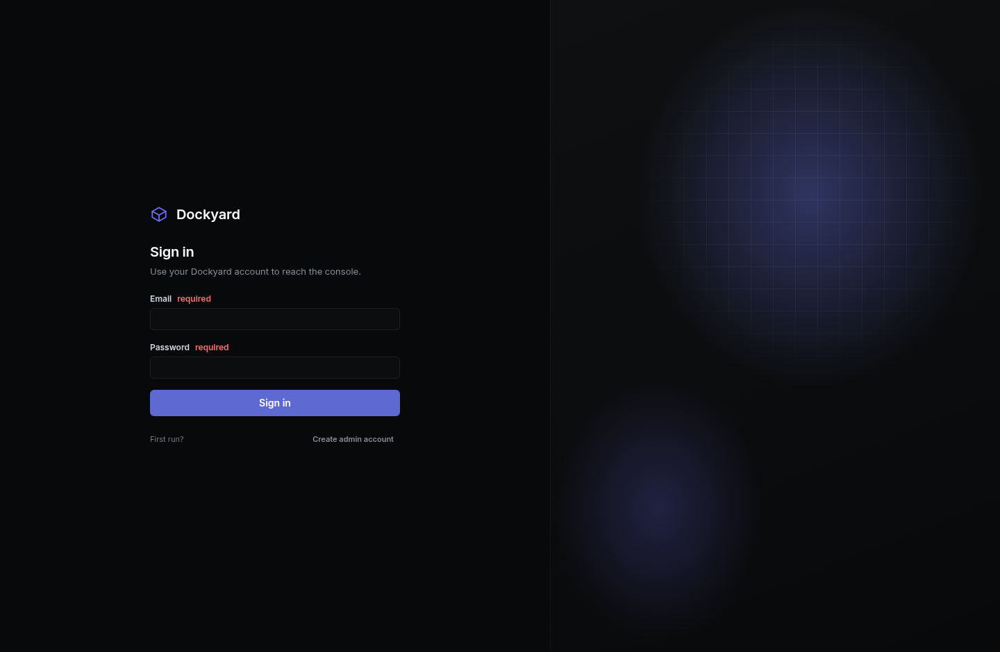

# Dockyard

A unified control panel for Docker containers. Portainer's job, without Portainer's
surface area: **containers, app templates, and Cloudflare tunnels** on one screen, backed by
Postgres.

- **Node.js + TypeScript** API (Fastify, run directly by Node's native type stripping, no build step)
- **Postgres** for users, sessions, audit trail, templates, stacks and tunnel state
- **React 19 + Vite** frontend, hand-written CSS, no UI framework
- **Docker Engine API** over the socket via `dockerode` (no `docker` CLI dependency)
- **Built-in Cloudflare tunnel support** in both flavours:
  - *non-persistent* (quick) — one click, no Cloudflare account, a `*.trycloudflare.com` URL
    that lives until you stop it
  - *persistent* (named) — a real named tunnel with its own credentials, config file and DNS
    route, restarted automatically when the panel boots



## Quick start (local)

```bash
cd dockyard
cp .env.example .env            # fill in DATABASE_URL, SECRET_KEY, admin credentials
npm install
node server/src/db/migrate.ts   # create the schema
node server/src/index.ts        # API + built frontend on http://localhost:8190
```

Frontend development runs Vite on `:5190` and proxies `/api` and `/ws` to `:8190`:

```bash
npm --workspace web run dev
```

## Quick start (Docker Compose)

```bash
export POSTGRES_PASSWORD="$(openssl rand -hex 16)"
export SECRET_KEY="$(node -e 'console.log(require("crypto").randomBytes(32).toString("hex"))')"
docker compose up -d --build
```

The compose file mounts `/var/run/docker.sock` into the panel and sets
`TUNNEL_TARGET_HOST=host.docker.internal` so tunnels can reach containers' published ports from
inside the panel's own container.

## How it is put together

```
server/src/
  index.ts      boot: config -> migrate -> buildApp -> listen
  app.ts        Fastify instance, plugins, routes, SPA fallback
  config.ts     env + .env loading
  db/           pg pool and SQL migrations
  docker/       Docker Engine API service layer (containers, images, volumes, networks, stats)
  auth/         scrypt password hashing, session cookies, roles, audit log
  routes/       one file per resource, mounted under /api
  ws/           log tail, live stats and a global event stream
  tunnels/      cloudflared supervision: quick and named tunnels
  cloudflare/   Cloudflare API v4 client
  templates/    template spec, built-in catalog, deploy engine
web/            React app (see web/DESIGN.md for the design system)
```

### API

Everything lives under `/api` and is documented in [`CONTRACT.md`](CONTRACT.md), which is the
frozen interface the whole project was built against. Highlights:

```
GET    /api/system/info
GET    /api/containers                 POST /api/containers
POST   /api/containers/:id/:action     GET  /api/containers/:id/logs
GET    /api/templates                  POST /api/templates/:slug/deploy
GET    /api/tunnels                    POST /api/tunnels
POST   /api/tunnels/:id/:action
GET    /api/cloudflare/status          POST /api/cloudflare/credentials
GET    /api/users                      POST /api/users/:id/grants
```

WebSocket endpoints: `/ws/containers/:id/logs`, `/ws/containers/:id/stats`, `/ws/events`.

### Roles

`viewer` reads, `operator` writes (no deletes, no settings), `admin` does everything. The first
user is created from `DOCKYARD_ADMIN_EMAIL` / `DOCKYARD_ADMIN_PASSWORD` on first boot, or through
`POST /api/auth/bootstrap` while the users table is empty. Every mutating call lands in
`audit_log`.

### Resource allocation

The role ladder decides what a user may **do**. It does not decide what they may **see** — by
default every authenticated user sees the whole host. `users.scope_mode` adds that second axis:

- `all` (the default) — the whole host, unchanged from before.
- `granted` — exactly the resources listed in `user_grants`, nothing else.

A grant is either an explicit resource (`resource_id`) or a label selector (`label_key` +
`label_value`), never both. **Prefer labels**: an explicit container id stops matching the moment
that container is recreated, whereas a label survives it.

```
GET    /api/users/:id/grants            list the allocation
POST   /api/users/:id/grants            allocate one resource
DELETE /api/users/:id/grants/:grantId   revoke one
DELETE /api/users/:id/grants            revoke all
```

Enforcement lives at the route boundary: list endpoints filter, per-id endpoints answer `404`.
A scoped-out resource returns `404` rather than `403` on purpose, because a `403` confirms the
resource exists and would let a restricted user enumerate the host by probing ids. Dashboard
counts are recomputed for a scoped user, since the engine totals describe the whole host.

Anything a scoped user creates inherits their grant label, so their own work stays visible: a
container they run, a volume they add, a stack they deploy from an allocated template.

Two things are deliberately not on the ladder:

- **Admins are never scoped.** Setting `scope_mode = 'granted'` on an admin is rejected, so there
  is always one account that can undo a bad allocation.
- **`exec` is not an operator right.** The panel mounts the Docker socket, so a shell in any
  container is root-equivalent on the host. It needs the explicit `users.can_exec` flag;
  administrators bypass it. The flag only applies to operators, since the route requires that role
  anyway.

An allocated user sees a notice at the top of every page explaining why their lists are short,
because an unexplained empty panel reads as a bug.

## Templates

The built-in catalog ships real images with real environment variables, ports and volume paths.
Deploying one renders the template with your values, creates the container, starts it, and records
a stack so the whole thing can be started, stopped or removed as a unit. Containers created by
Dockyard are labelled:

```
dockyard.managed=true
dockyard.stack=<stack id>
dockyard.template=<template slug>
```

so the panel can tell its own containers apart from anything else on the host. User templates can
be created, edited and deleted from the UI and are validated against the same spec schema.

## Cloudflare tunnels

| | quick (non-persistent) | named (persistent) |
|---|---|---|
| Cloudflare account | not needed | required |
| URL | random `*.trycloudflare.com` | your own hostname on your zone |
| Survives panel restart | no | yes, if `auto_start` is on |
| Credentials on disk | none | `data/tunnels/<slug>/credentials.json` |

Named tunnels need an API token with `Account: Cloudflare Tunnel:Edit` and `Zone:DNS:Edit`. Add it
in **Settings** (stored AES-256-GCM encrypted in the `settings` table) or via
`CLOUDFLARE_API_TOKEN` / `CLOUDFLARE_ACCOUNT_ID`. The token is never returned by the API and never
logged.

## Security notes

- Mounting the Docker socket gives the panel root-equivalent power over the host. Put it behind
  TLS and an authenticating proxy before exposing it.
- Sessions are opaque tokens; only a SHA-256 hash is stored. Passwords use scrypt.
- Secrets at rest (`cloudflare.api_token`) are encrypted with `SECRET_KEY`. Rotating `SECRET_KEY`
  invalidates stored secrets, nothing else.
- `.env` should be mode `0600` and must never be committed.

## Tests

```bash
export PATH=/root/.hermes/node/bin:$PATH
npm test                               # server: migrations, docker, api, tunnels, templates, scope
npm --workspace web run typecheck
npm --workspace web run test           # component and page tests (vitest)
npm --workspace web run build
npx playwright test --config web/playwright.config.ts   # end-to-end against a real API
```

`server/test/mock-docker.ts` is a test double that speaks the subset of the Docker Engine API this
panel uses, so the suite runs without a daemon. When a real daemon is reachable the tests exercise
it too — including the scoping tests, which create real containers and check that a scoped session
cannot list, inspect, stop or exec into one it was not allocated.

The end-to-end suite raises the login rate limit (`DOCKYARD_LOGIN_RATE_MAX`) because it signs in
many throwaway accounts from one IP. The shipped default stays at 10 per minute.
